# 🎵 Music Recommender Simulation

## Project Summary

In this project you will build and explain a small music recommender system.

Your goal is to:

- Represent songs and a user "taste profile" as data
- Design a scoring rule that turns that data into recommendations
- Evaluate what your system gets right and wrong
- Reflect on how this mirrors real world AI recommenders

Replace this paragraph with your own summary of what your version does.

---

## How The System Works

Real-world music recommenders not only look for songs that the user has heard before, but also their properties. They use these properties or data features such as mood, genre, tempo etc. to evaluate why a user liked a certain song and then recommends other songs that generally share these properties. My system will prioritize how close a certain data feature is to a user's preferences rather than prioritizing which feature consists of the largest score. For example, a song with energy closer to a user's target energy will be recommended more likely than the one with the most energy.
Each `Song` includes concrete features and general facts about the song like id, title, artist, genre, mood, energy, tempo_bpm, valence, danceability, and acousticness.
Each `UserProfile` includes user's preferences such as favorite_genre, favorite_mood, target_energy, and likes_acoustic.
The `Recommender` computes a score for each song by measuring how closely its genre, mood, energy, valence, and acousticness match the user's profile, combines those into a weighted total between 0 and 1, then returns the top songs with the highest scores.

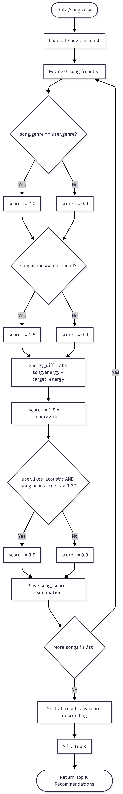

**Algorithm Recipe:**
Genre will carry the most weight since it is the strongest signal determined by a listener's identity (+2.0 points).
Mood is weighted second because it represents the user's current context and why they are listening to a certain song during a certain event in their life (+1.5 points).
Energy similarity (+0.0 to +1.5 points) is calculated based on how close a song's energy is to the user's target energy, and acousticness (+0.5 points) is considered only if a user prefers acoustic songs.

**Potential Biases:**
Sometimes, the mood and energy of a user may be more important to them than the genre. However, since genre has the highest weight, a song meeting the user's mood and energy requirements but in a different genre may not be recommended to the user even though they may prefer this option more. Additionally, there are only a few songs in the catalog, so the top result may not be ideal for the user.

**CLI terminal output showing recommendations:**

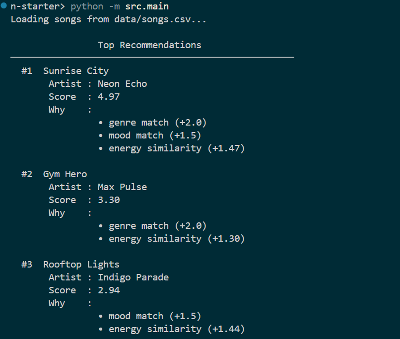
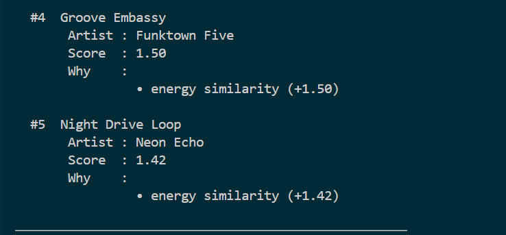

**Stress Test with Diverse Profiles:**

-- Standard Profiles (High-Energy Pop, Chill Lofi, Deep Intense Rock) --

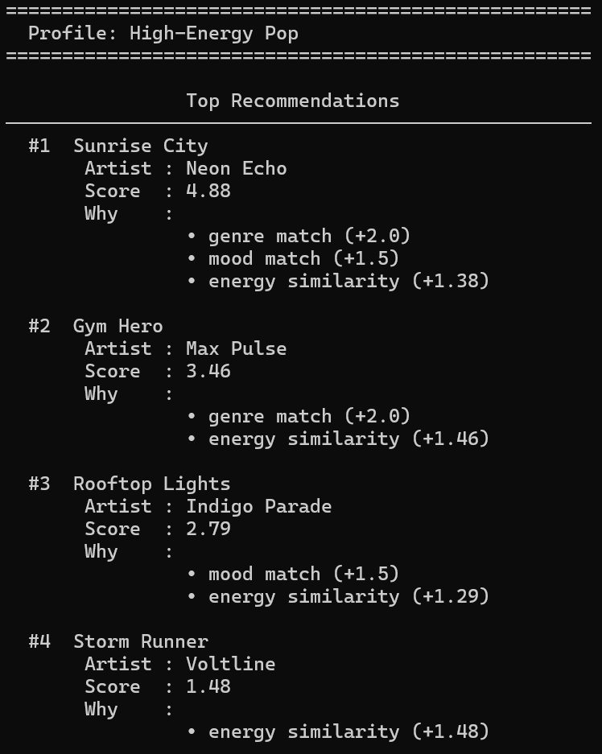
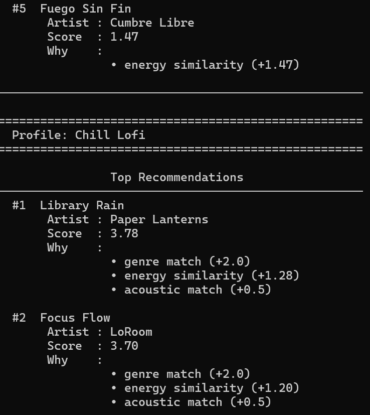
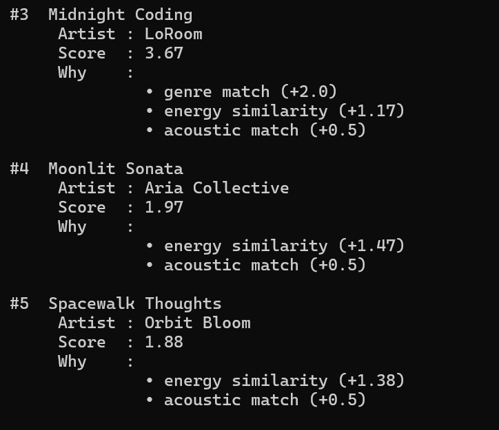
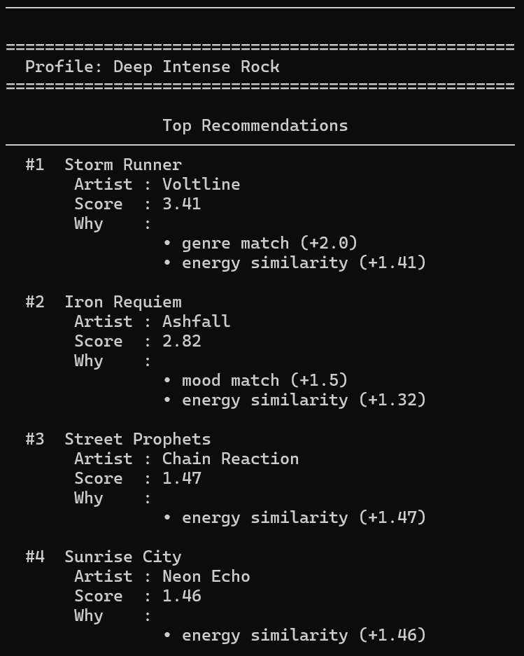


-- Adversarial Profiles --

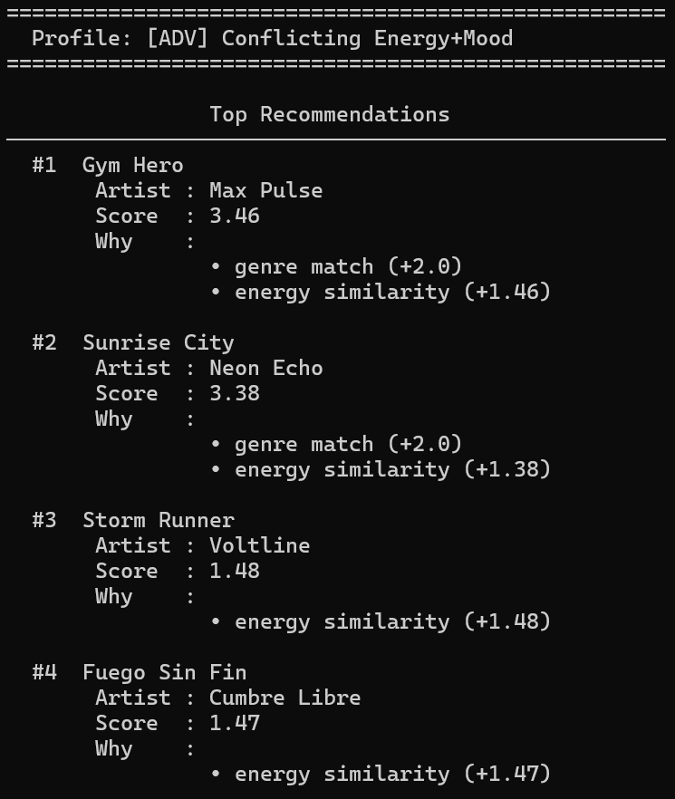
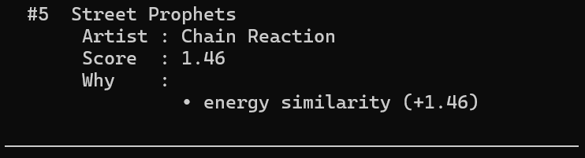
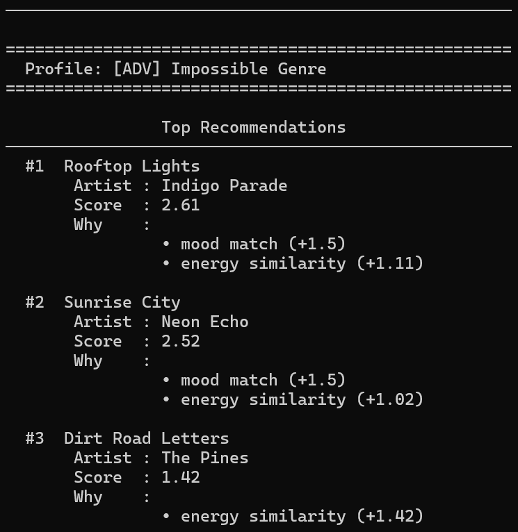
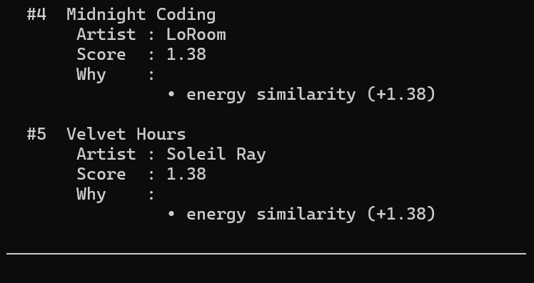
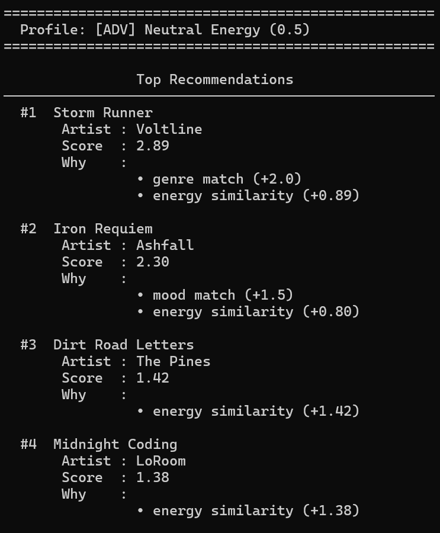
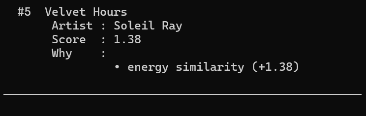
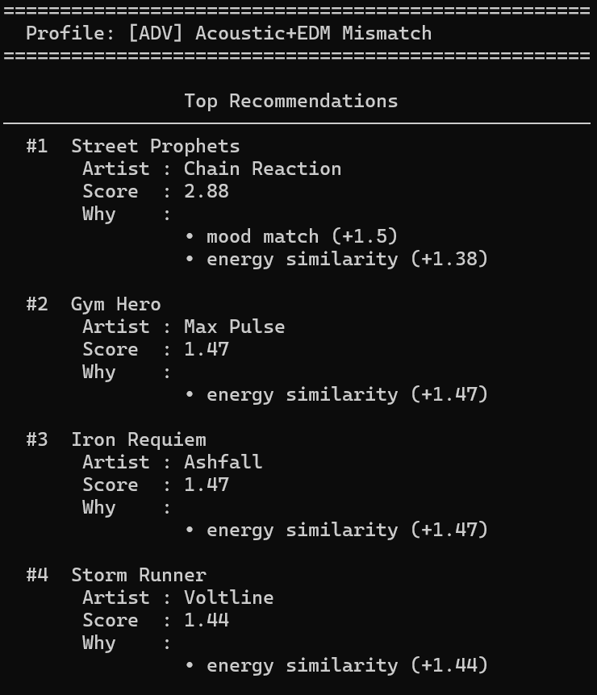

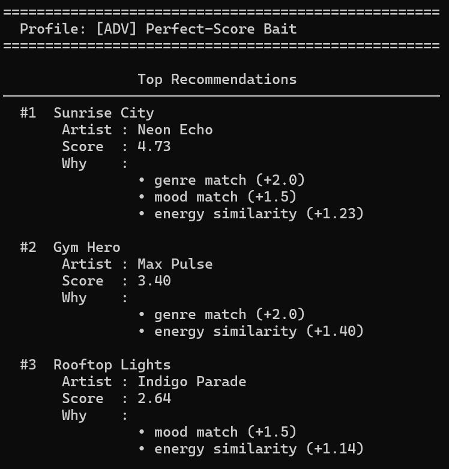
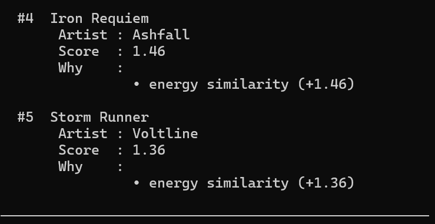

---

## Getting Started

### Setup

1. Create a virtual environment (optional but recommended):

   ```bash
   python -m venv .venv
   source .venv/bin/activate      # Mac or Linux
   .venv\Scripts\activate         # Windows

2. Install dependencies

```bash
pip install -r requirements.txt
```

3. Run the app:

```bash
python -m src.main
```

### Running Tests

Run the starter tests with:

```bash
pytest
```

You can add more tests in `tests/test_recommender.py`.

---

## Experiments You Tried

- **Changing genre weight from 2.0 to 1.0:** Halving the genre weight let mood and energy contribute more equally, so songs from other genres with a strong mood and energy match could surface instead of being buried. This made recommendations feel less genre-locked but also occasionally surfaced off-genre songs the user likely wouldn't enjoy.

- **Doubling energy weight from 1.5× to 3.0×:** This made the scoring much more sensitive to how closely a song's energy matched the user's target, which helped distinguish near-ties within the same genre and mood. The tradeoff is that two songs differing only slightly in energy can now end up with significantly different scores.

- **Standard user profiles (High-Energy Pop, Chill Lofi, Deep Intense Rock):** Each profile consistently surfaced expected genre and mood matches near the top, confirming the core scoring logic worked correctly for straightforward preferences.

- **Adversarial profiles (Conflicting Energy+Mood, Impossible Genre, Neutral Energy, Acoustic+EDM Mismatch, Perfect-Score Bait):** Edge cases revealed some limitations and biases. A user wanting sad mood but high energy would still receive upbeat songs because energy dominates, and a user whose genre doesn't exist in the dataset received results ranked purely by mood and energy match, making the top picks essentially arbitrary.

---

## Limitations and Risks

- The catalog is too small to produce meaningfully diverse recommendations.
- Genre is hardcoded as the top signal, even when the user cares more about mood or energy.
- Songs with a missing genre match are ranked essentially at random.
- The system has no concept of listening history, novelty, or user feedback over time.

---

## Reflection

Completed `model_card.md`:

[**Model Card**](model_card.md)

My biggest learning moment was when I ran the adversarial stress tests. The "Impossible Genre" profile (a genre that did not exist in the dataset) produced results that looked like real recommendations but were ranked almost arbitrarily, since only mood and energy were contributing any score. The system had no way to signal uncertainty; it just picked confidently anyway. I learned that a model outputting something is not the same as a model knowing what it's doing. Claude Code helped me generate sample boilerplate code for `Song` and `UserProfile`, and I used it for explanations of any code that was unfamiliar to me. I had to verify AI output was when I was using AI to build the scoring system, where I asked it for explanations on why it chose certain scores for specific data features.

I was surprised by the fact that recommendation systems like this use simple algorithms, and that these recommendations can be calculated by a simple arithmetic formula. I find it interesting that "recommendations" are not complex, intelligent operations, but are based on simple, mechanic formulas created by the developer of the system. If I extended this project, I would try adding more songs with more diverse genres and other data features to the dataset to reduce the bias towards high-energy music lovers.

---

## 7. `model_card_template.md`

Combines reflection and model card framing from the Module 3 guidance. :contentReference[oaicite:2]{index=2}  

```markdown
# 🎧 Model Card - Music Recommender Simulation

## 1. Model Name

> CadenceMatcher 1.0

---

## 2. Intended Use

CadenceMatcher recommends songs from a small catalog based on a listener's stated genre, mood, energy, and acoustic preferences. It returns a ranked list of the top five songs that best match those preferences.

It assumes the user already knows what they like and can describe it in simple terms. It does not learn from listening history or adapt over time.

This system is built for classroom exploration to analyze how scoring rules and different data choices affect recommendations.

---

## 3. How It Works (Short Explanation)

Each song in the catalog has a genre, mood, energy level (0 to 1), and an acousticness value (0 to 1). The system compares those values against the user's stated preferences and adds up points.

- If the song's genre matches what the user likes, it gets 1 point.
- If the song's mood matches, it gets 1.5 points.
- The closer the song's energy is to the user's target energy, the more points it earns — up to 3 points for a perfect match.
- If the user likes acoustic music and the song is acoustic enough, it gets an extra 0.5 points.

The song with the highest total score is ranked first.

When genre bonus was cut in half (from 2.0 to 1.0 points), genre alone could not dominate the result. The energy bonus was doubled in range (from a max of 1.5 to a max of 3.0 points) so that energy became the strongest single signal, rewarding songs that closely match the user's preferred intensity level.

---

## 4. Data

The size of the dataset is 18 songs. 

The genres included in the catalog are: pop, lofi, rock, ambient, jazz, synthwave, indie pop, hip-hop, classical, r&b, country, metal, latin, folk, and funk. Moods include: happy, chill, intense, relaxed, moody, focused, energetic, peaceful, romantic, nostalgic, angry, uplifting, groovy, and melancholic.

A key limitation is that several areas of musical taste are missing. There is no k-pop, no reggae, no blues, and no electronic subgenres beyond synthwave and EDM references in the profiles. Mood coverage is also uneven. For example, romantic, nostalgic, and groovy each appear in only one song, so users with those preferences will rarely get a mood match.

---

## 5. Strengths

The system works best for users with high-energy preferences. There are many high-energy songs in the catalog, so those users get strong matches across genre, mood, and energy at the same time.

The energy similarity component is the strongest part of the scoring. Because it can contribute up to 3 points, it consistently pulls songs that actually sound like what the user wants — even when genre or mood do not match.

The system's outputs are simple and less cluttered, making it easier and less overwhelming to use.

---

## 6. Limitations and Bias

Of the 17 songs in the dataset, 9 have an energy level above 0.7, while only 5 fall below 0.4. This leads to a limitation in the system, where high-energy genres like rock, pop, metal, and EDM are more represented in the data than calm genres like ambient, classical, and folk. Because the energy similarity score rewards closeness to the user's target, a low-energy listener (for example, a user who prefers ambient or sleep music near energy 0.1) has far fewer songs that can score well on energy, and the songs that do appear near their target are also spread across unrelated genres and moods. During testing, the "Chill Lofi" profile consistently surfaced acoustic songs from non-lofi genres in its top 5 simply because they happened to sit near the right energy value, not because they were stylistically close. This means the system quietly delivers worse recommendations to users with quieter tastes, not because of a flaw in the scoring formula itself, but because the data it scores against was never balanced to represent them fairly. This leads to high bias, which would be problematic if implemented in a real product.

---

## 7. Evaluation

Eight profiles were tested using the `src/main.py` file: three standard (High-Energy Pop, Chill Lofi, Deep Intense Rock) and five adversarial (Conflicting Energy+Mood, Impossible Genre, Neutral Energy, Acoustic+EDM Mismatch, Perfect-Score Bait). For each run, the goal was to check whether the top-ranked song felt like something a real listener would actually want, and whether the score reasons honestly explained the result. Some results I found interesting are:

High-Energy Pop vs. Chill Lofi: These two profiles are at opposite energy extremes and the results reflected that; uptempo pop at the top of one, quiet lofi at the top of the other. However, I found it surprising that Chill Lofi never matched on mood once. The user preference said "calm" but every lofi song in the catalog is labeled "chill." The system treated those as a complete mismatch even though they mean nearly the same thing to a real person.

Conflicting Energy+Mood vs. High-Energy Pop: Swapping mood from "happy" to "sad" reshuffled the top results, but the system still returned energetic, upbeat songs because no pop songs with a sad mood exist in the dataset. The mood signal never fired at all. The system had no way to say that there are no matches for the user's preferences and just quietly returned the wrong thing.

Impossible Genre vs. Neutral Energy: Both disable one major signal. Impossible Genre (k-pop) means the genre bonus never fires. Neutral Energy (target 0.5) means energy scores bunch together and barely separate songs. In both cases the middle rankings felt arbitrary. Small coincidences in the data determined third versus fifth place.

---

## 8. Future Work

- The system should include mood synonym matching. For example, right now "calm" and "chill" are treated as completely different, even though they mean the same thing to most listeners. A simple lookup table of equivalent mood labels would fix a lot of missed matches.

- For better explanations, the system could also say when something did not match. Telling a user that no matches were found is more accurate than silently returning wrong results.

- More songs should be incorporated into the dataset, especially in underrepresented genres and moods, so that edge-case users have real options instead of accidental near-matches.

---

## 9. Personal Reflection

Building this made me realize that representative data matters just as much as a good algorithm. The scoring logic can be well-designed, but if the dataset is unbalanced, some users will quietly be more favored than others.

The most surprising thing was how much the mood label mismatch (calm vs. chill) broke the Chill Lofi profile. Two words that feel identical to a human completely shut off a scoring signal. It made me think about how much hidden work goes into label consistency in real music platforms.

I now look at apps like Spotify or YouTube differently. When a recommendation feels slightly off, I suspect the issue is not always the algorithm; it is probably a missing or mismatched label somewhere in the data pipeline. The algorithm can only work with what it is given. Thus, human judgement matters when creating more diverse datasets and better recommendations while also considering tradeoffs in time and memory space.